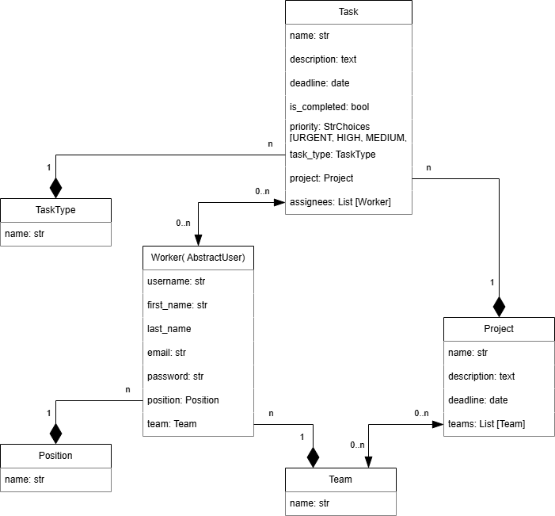

# Task Manager

A Django-based task and project management system designed to organize tasks, projects, and teams. It includes support for custom user roles, task types, priorities, and structured project organization.

## Features

* Custom `Worker` model (extends `AbstractUser`)
* Organized teams and positions
* Project assignment to teams
* Tasks linked to projects, teams, workers, and types
* Task priority and completion tracking
* Custom queryset and manager for task priority ordering

## Database diagram



---

## Models Overview

### 1. `TaskType`

Represents the category or type of task.

* **Fields**:

  * `name`: `CharField` – Name of the task type
* **Meta**:

  * Ordered by name

### 2. `Position`

Represents a job role or position within the team.

* **Fields**:

  * `name`: `CharField` – Title of the position
* **Meta**:

  * Ordered by name

### 3. `Team`

Groups of workers that can be assigned to projects.

* **Fields**:

  * `name`: `CharField` – Team name
* **Meta**:

  * Ordered by name

### 4. `Worker`

Custom user model extending Django’s `AbstractUser`.

* **Fields**:

  * `position`: `ForeignKey` to `Position` (nullable)
  * `team`: `ForeignKey` to `Team` (nullable)
* **Meta**:

  * Ordered by `username`

### 5. `Project`

A collection of tasks assigned to one or more teams.

* **Fields**:

  * `name`: `CharField` – Project title
  * `description`: `TextField` – Description of the project
  * `deadline`: `DateField` – Project deadline
  * `teams`: `ManyToManyField` to `Team`
* **Meta**:

  * Ordered by deadline (descending)

### 6. `Task`

An individual task assigned to workers and linked to a project.

* **Fields**:

  * `name`: `CharField`
  * `description`: `TextField`
  * `deadline`: `DateField`
  * `is_completed`: `BooleanField` – Task completion status
  * `priority`: `CharField` – One of `URGENT`, `HIGH`, `MEDIUM`, `LOW`
  * `task_type`: `ForeignKey` to `TaskType` (nullable)
  * `project`: `ForeignKey` to `Project` (nullable)
  * `assignees`: `ManyToManyField` to `Worker`

* **Meta**:

  * Custom priority ordering

---

## Task Priority System

Tasks are ordered based on the following logic:

1. `is_completed` – Incomplete tasks appear first
2. `deadline` – Earlier deadlines appear first
3. `priority` – Ordered: URGENT > HIGH > MEDIUM > LOW

This is achieved using a custom `TaskQuerySet` and `TaskManager`.

---

## Setup (Assuming Django is Installed)

```bash
python manage.py makemigrations
python manage.py migrate
python manage.py createsuperuser
python manage.py runserver
```

## Admin Features

* Manage tasks, teams, workers, projects, and more via the Django admin panel.

---

## License

MIT – Use freely with attribution.
